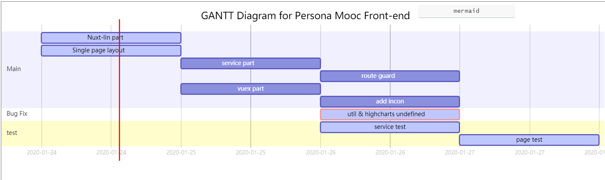

`TODOS`
- util.types.isExternal未定义问题
    - 手写原函数?
- highcharts.getOptions未定义问题
- service部分补全
- store部分解决
- 路由守卫
- main 的布局
- 各个chart-card部分
    - layout 里面v-for?
    - 手撸每一个?
--- 
`plan`

---
`structure`
